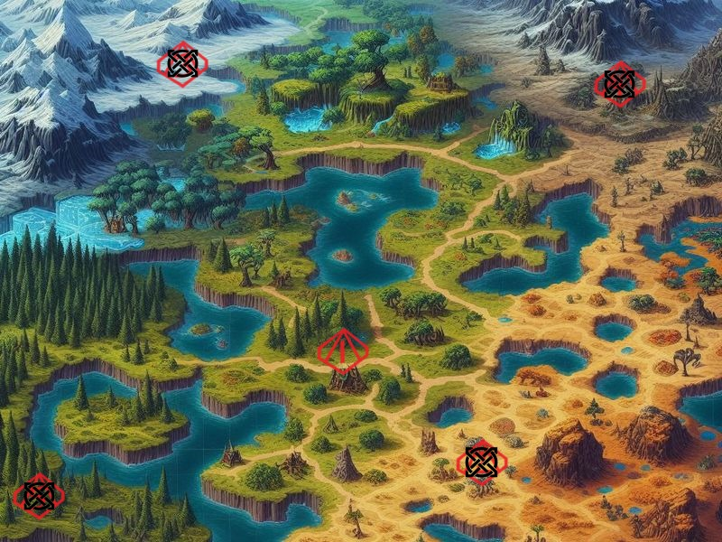

# EXAME_CES11

Hey, this is you!! 

This is a RPG Action Game build for your mouse to crash!

Get ready to kill the enemies in every place of the world!! They are waiting for you...

Use your mouse for Attacks and Dash (obviously..)

Now Let's go kill some Goblins!!!

### You will need to run this game with the CMakeList, in the CLion's IDE for the executable
